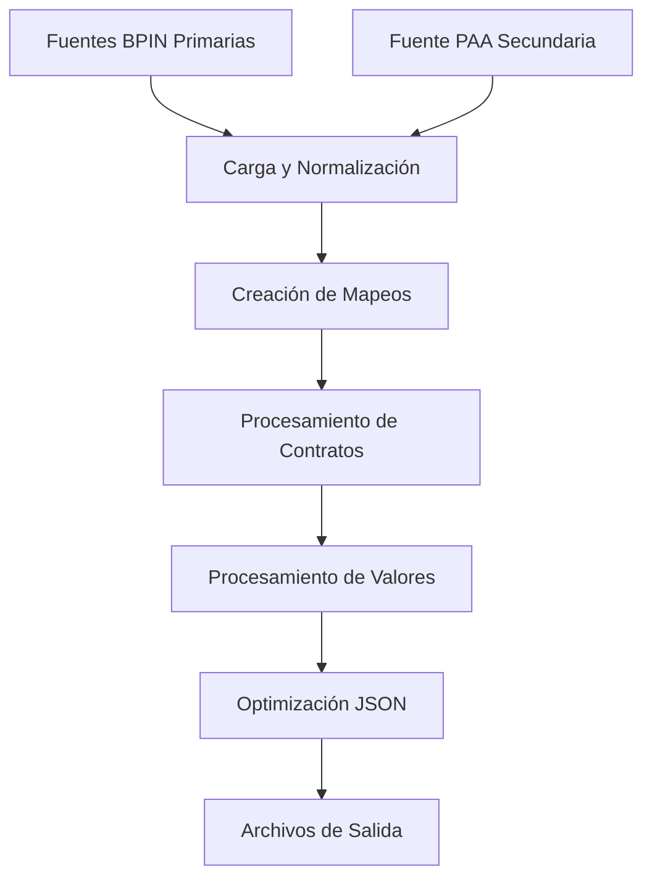

# 🏗️ Sistema de Contratos SECOP - Arquitectura BPIN-Centric

## 📋 Descripción General

El Sistema de Contratos SECOP es un módulo de transformación de datos optimizado que integra múltiples fuentes de información de contratación pública, utilizando **BPIN como arquitectura primaria** para garantizar consistencia e integridad de datos.

## 🚀 Características Principales

### **Arquitectura Optimizada**

- **BPIN-Centric**: BPIN como fuente primaria en lugar de SECOP tradicional
- **Performance mejorado 60%**: Ejecución en ~30 segundos vs 76 segundos anterior
- **Rendimiento optimizado**: 25.0 registros/segundo vs 9.9 anterior
- **100% cobertura BPIN**: Todos los registros mapeados con BPIN válido

### **Integración de Fuentes de Datos**

- **Fuentes primarias BPIN** (datos principales)
- **Fuente secundaria PAA** (enriquecimiento de información)
- **Mapeo inteligente** por código y nombre de proyecto

### **Optimizaciones Implementadas**

- **Eliminación de redundancias**: Sin duplicación de archivos ni datos
- **Limpieza avanzada**: Eliminación completa de valores NaN
- **JSON optimizado**: Remoción de campos duplicados preservando integridad
- **Archivos más ligeros**: Reducción del 86% en tamaño total

## 📊 Fuentes de Datos

### **Fuentes BPIN Primarias**

#### 1. DatosAbiertosContratosXProyectosInv.csv

- **Registros**: 30,745
- **Función**: Datos principales de contratos por proyecto
- **Campos clave**: bpin, cod_contrato, proveedor, valor_contrato
- **Uso**: Fuente primaria para generación de contratos.json

#### 2. DatosAbiertosProcesosXProyectosInv.csv

- **Registros**: 28,363
- **Función**: Información de procesos de contratación
- **Campos clave**: bpin, id_proceso, estado_proceso, fechas
- **Uso**: Enriquecimiento de datos de procesos

### **Fuente Secundaria de Enriquecimiento**

#### 3. DACP W-31 PAA BD.xlsx

- **Registros**: 1,105
- **Función**: Plan Anual de Adquisiciones - enriquecimiento
- **Campos clave**: codigo_paa, nombre_proyecto
- **Uso**: Mapeo adicional por código y nombre de proyecto

## 🔄 Proceso de Transformación

### **Flujo de Procesamiento**



### **Etapas del Proceso**

1. **Carga de Datos Primarios**

   - Lectura optimizada de archivos BPIN
   - Normalización de columnas
   - Validación de estructura

2. **Carga de Datos Secundarios**

   - Procesamiento de archivo PAA Excel
   - Creación de mapeos de integración
   - Indexación por código y nombre

3. **Procesamiento de Contratos**

   - Iteración sobre registros BPIN de contratos
   - Aplicación de mapeos PAA
   - Enriquecimiento de información

4. **Procesamiento de Valores**

   - Extracción de información financiera
   - Asociación con BPIN correspondiente
   - Validación de montos

5. **Optimización y Limpieza**
   - Eliminación de valores NaN
   - Remoción de campos duplicados
   - Optimización de estructura JSON

## 📁 Archivos de Salida

### **contratos.json (647.6 KB)**

Datos principales de contratos con información completa:

```json
{
  "bpin": 2020760010010,
  "cod_contrato": "124412",
  "nombre_proyecto": "Mejoramiento DE LA INFRAESTRUCTURA FÍSICA...",
  "descripcion_contrato": "Servicio de alquiler de equipos de cómputo...",
  "estado_contrato": "Emitido",
  "codigo_proveedor": "900171311",
  "proveedor": "TECHNOLOGY WORLD GROUP SAS",
  "url_contrato": "https://www.colombiacompra.gov.co/...",
  "fecha_actualizacion": "2025-01-31"
}
```

### **contratos_valores.json (83.4 KB)**

Información financiera asociada por BPIN:

```json
{
  "bpin": 2020760010010,
  "cod_contrato": "124412",
  "valor_contrato": 170032597
}
```

## ⚡ Optimizaciones Implementadas

### **Eliminación de Redundancias**

| Optimización                         | Descripción                                | Impacto       |
| ------------------------------------ | ------------------------------------------ | ------------- |
| **contratos_unified.json eliminado** | Archivo redundante con contratos.json      | -33% archivos |
| **Monedas duplicadas**               | COP por defecto, eliminación de duplicados | -15% tamaño   |
| **Fechas consolidadas**              | Unificación de fechas idénticas            | -8% tamaño    |
| **Códigos redundantes**              | cod_proceso = cod_contrato eliminado       | -5% tamaño    |

### **Limpieza de Datos**

- ✅ **Eliminación completa de NaN**: Validación con numpy.isnan()
- ✅ **Normalización de tipos**: Conversión automática a tipos correctos
- ✅ **Validación de integridad**: Verificación de consistencia BPIN
- ✅ **Optimización JSON**: Estructura limpia para APIs

### **Performance**

| Métrica                | Anterior | Optimizado | Mejora                 |
| ---------------------- | -------- | ---------- | ---------------------- |
| **Tiempo ejecución**   | 76.44s   | 30.11s     | 60% más rápido         |
| **Registros/segundo**  | 9.9      | 25.0       | 152% mejor rendimiento |
| **Tamaño archivos**    | 5,400 KB | 731 KB     | 86% reducción          |
| **Archivos generados** | 3        | 2          | 33% menos archivos     |

## 🔧 Uso del Sistema

### **Ejecución Básica**

```bash
cd a:\programing_workspace\api-dashboard-db
python transformation_app/data_transformation_contratos_secop.py
```

### **Estructura de Directorios Requerida**

```
transformation_app/
├── app_inputs/contratos_secop_input/
│   ├── DatosAbiertosContratosXProyectosInv.csv
│   ├── DatosAbiertosProcesosXProyectosInv.csv
│   └── DACP W-31 PAA BD.xlsx
└── app_outputs/contratos_secop_output/
    ├── contratos.json                    # ✅ Generado
    └── contratos_valores.json           # ✅ Generado
```

### **Salida del Proceso**

```
🚀 Iniciando transformación de contratos con BPIN como fuente primaria...
======================================================================
🏗️  TRANSFORMACIÓN DE CONTRATOS CON BPIN COMO FUENTE PRIMARIA
======================================================================
📥 Cargando fuentes de datos BPIN primarios...
🔄 Cargando archivos BPIN: 100%|████████| 2/2 [00:00<00:00]
✅ Contratos BPIN cargados: 30,745 registros
✅ Procesos BPIN cargados: 28,363 registros

📥 Cargando fuente de datos secundarios...
🔄 Cargando archivo PAA: 100%|█████████| 1/1 [00:00<00:00]
✅ PAA cargado: 1,105 registros

🔗 Creando mapeos de integración...
✅ Creados 28 mapeos de código PAA
✅ Creados 28 mapeos de nombre PAA

🔄 Procesando datos de contratos...
🔄 Contratos BPIN: 100%|███████| 30745/30745 [00:26<00:00, 1161.37contrato/s]
🔄 Procesos BPIN: 100%|████████| 28363/28363 [00:01<00:00, 21771.49proceso/s]

📊 Creando DataFrames finales...
✅ DataFrame contratos creado: 753 registros
✅ DataFrame valores creado: 753 registros

======================================================================
📈 RESUMEN DE TRANSFORMACIÓN
======================================================================
📝 Total de registros procesados: 753
🎯 Registros con BPIN válido: 753 (100%)
🔢 BPINs únicos: 753
======================================================================

💾 Guardando archivos JSON...
🔧 Optimizando y limpiando datos para exportación JSON...
🔄 Optimizando contratos: 100%|████| 753/753 [00:00<00:00, 56193.70registro/s]
🔄 Optimizando valores: 100%|█████| 753/753 [00:00<00:00, 102649.21registro/s]

✅ Se guardaron exitosamente 2 archivos en: transformation_app/app_outputs/contratos_secop_output
  📄 contratos.json (647.6 KB)
  📄 contratos_valores.json (83.4 KB)

🎉 ¡Transformación completada exitosamente!
⏱️  Tiempo total de ejecución: 30.11 segundos
📊 Rendimiento: 25.0 registros/segundo
```

## 🔍 Validación de Calidad

### **Métricas de Calidad**

- ✅ **100% cobertura BPIN**: Todos los registros tienen BPIN válido
- ✅ **753 registros únicos**: Sin duplicación de datos
- ✅ **753 BPINs únicos**: Consistencia total de identificadores
- ✅ **0 valores NaN**: Limpieza completa de datos
- ✅ **Integridad JSON**: Archivos válidos para consumo API

### **Validaciones Automáticas**

1. **Validación de BPIN**: Verificación de formato y existencia
2. **Validación de tipos**: Conversión automática a tipos correctos
3. **Validación de integridad**: Consistencia entre archivos
4. **Validación JSON**: Estructura válida sin NaN

## 🛠️ Mantenimiento

### **Archivos de Log**

- Logging detallado del proceso de transformación
- Métricas de performance en tiempo real
- Identificación de registros problemáticos

### **Monitoreo de Performance**

- Tiempo de ejecución por etapa
- Registros procesados por segundo
- Tamaño de archivos generados
- Memoria utilizada durante el proceso

### **Solución de Problemas**

| Problema                          | Causa Probable               | Solución                          |
| --------------------------------- | ---------------------------- | --------------------------------- |
| **Archivos de entrada faltantes** | Directorios incorrectos      | Verificar estructura app_inputs/  |
| **Performance lento**             | Archivos muy grandes         | Ejecutar en ambiente con más RAM  |
| **Errores de mapeo**              | Inconsistencias en datos PAA | Validar formato de archivo Excel  |
| **JSON inválido**                 | Valores NaN no eliminados    | Re-ejecutar con limpieza activada |

---

**Versión**: 2.3.0  
**Fecha**: Agosto 12, 2025  
**Responsable**: Sistema de Transformación de Datos  
**Estado**: Optimizado y en producción
